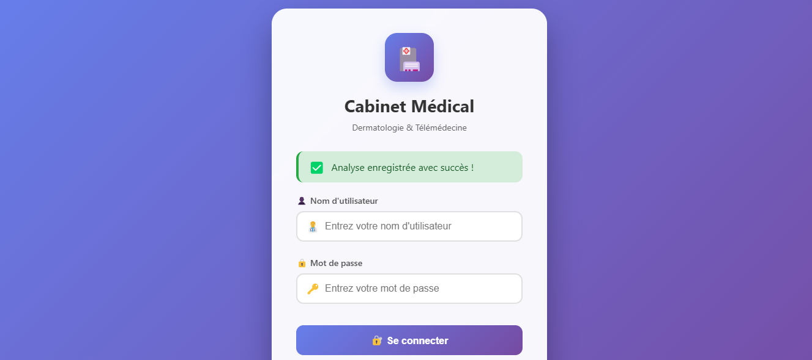
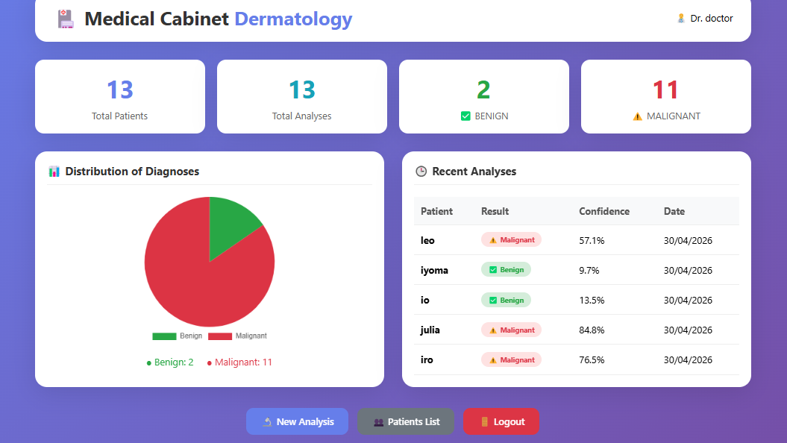
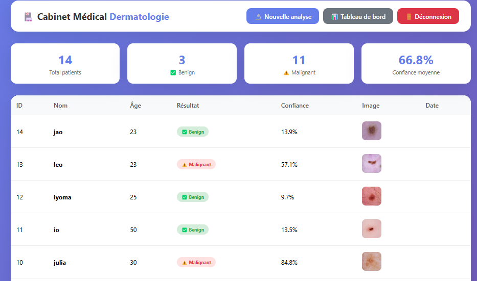
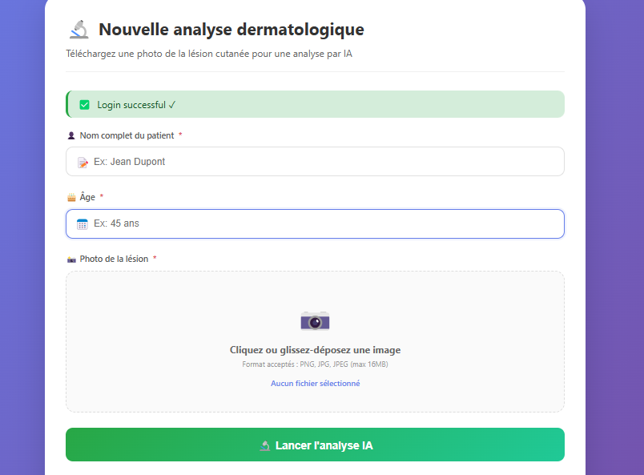
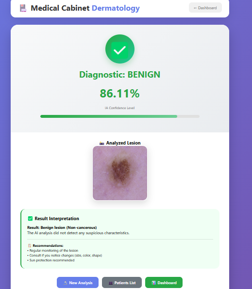

# 🩺 Skin Cancer Detection App

## 👥 Auteur
Farah Ghanney

## 🛠️ Technologies
- Flask
- TensorFlow VGG16
- MySQL
- Chart.js

## 🔑 Identifiants
- Username: `doctor`
- Password: `123`

## ⚙️ Installation
```bash
cd C:\Users\bassem\Desktop\SKIN_CANCER_APP
venv\Scripts\activate
python app.py
```

## 🖼️ Aperçu des interfaces

### Page de connexion


### Tableau de bord


### Liste des patients


### Page d'analyse


### Résultat Bénin


## ⚠️ Avertissement
Outil d'aide au diagnostic uniquement - Ne remplace pas un avis médical.

© 2026 - Farah Ghanney